# Отчет по практической работе №1
## Студент: SMV
## Группа: 16
## Дата выполнения: 28.02.2026
### 1. Выполненные команды Docker
#### 1.1 Работа с образами
Поиск образов в Docker Hub

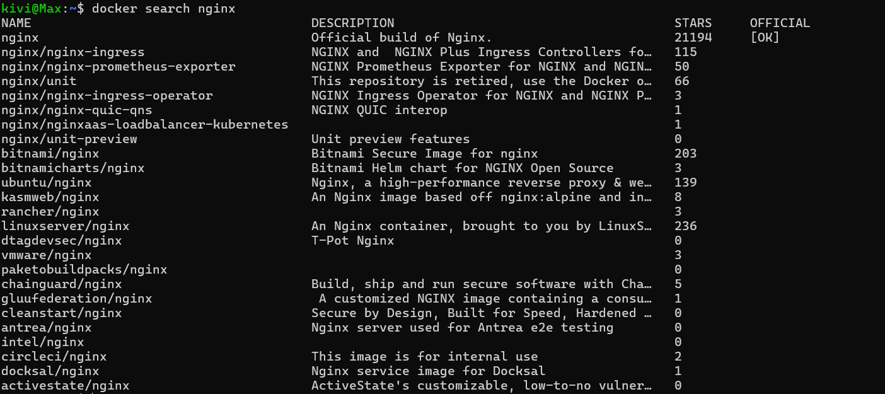

Скачивание образа

Просмотр локальных образов

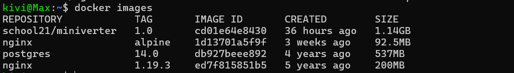

Просмотр истории слоев образа

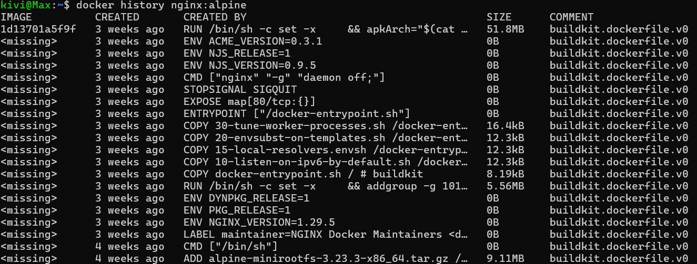

Удаление образа

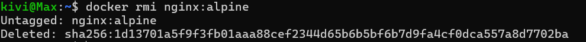

---
Практическое задание:
---

Поиск образа PostgreSQL 15 версии alpine

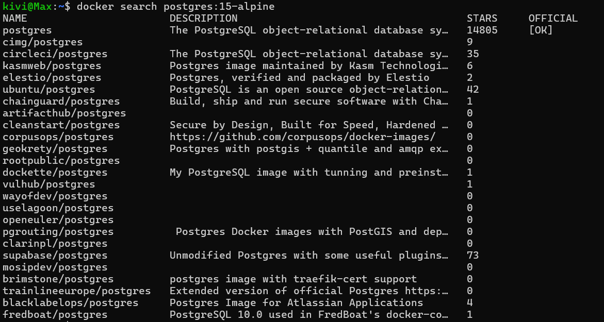

Скачивание образа PostgreSQL 15 версии alpine

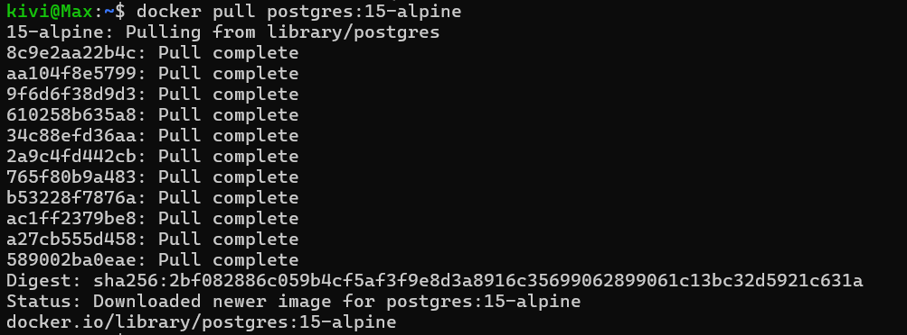

Поиск образа golang 1.21 версии alpine

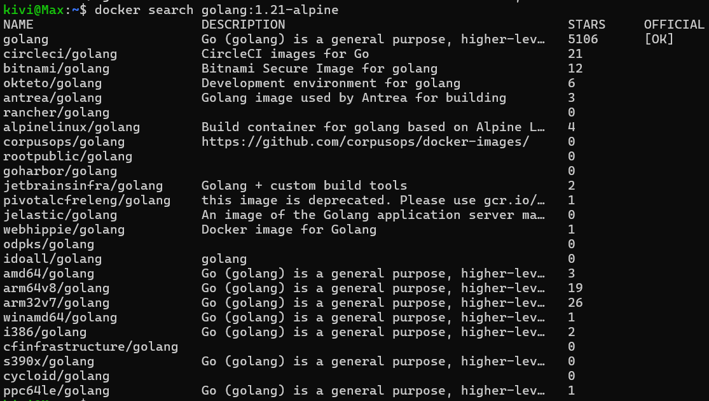

Скачивание образа golang 1.21 версии alpine

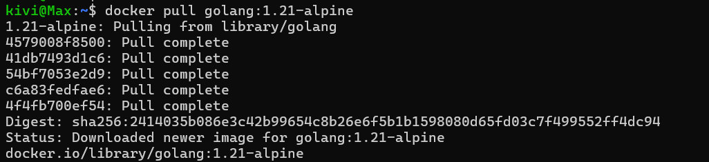

#### 1.2 Работа с контейнерами

Запуск контейнера alpine в интерактивном режиме

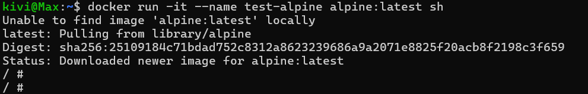

Запуск контейнера в фоновом режиме

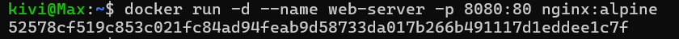

Просмотр запущенных контейнеров

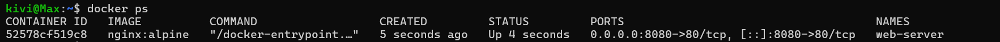

Просмотр всех контейнеров (включая остановленные)

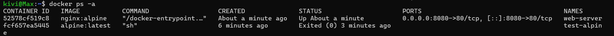

Просмотр логов контейнера

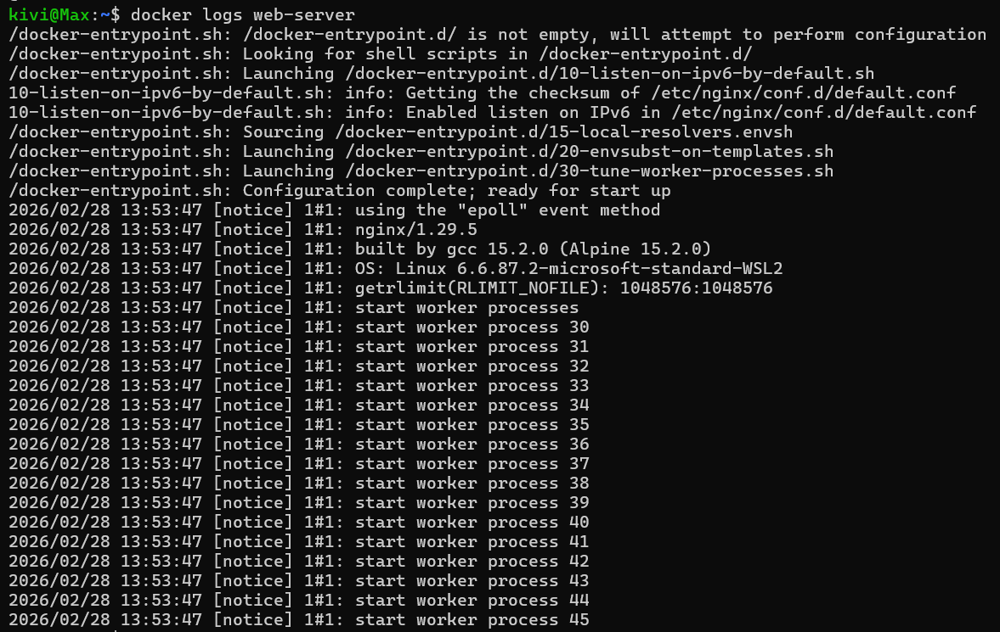

Подключение к работающему контейнеру

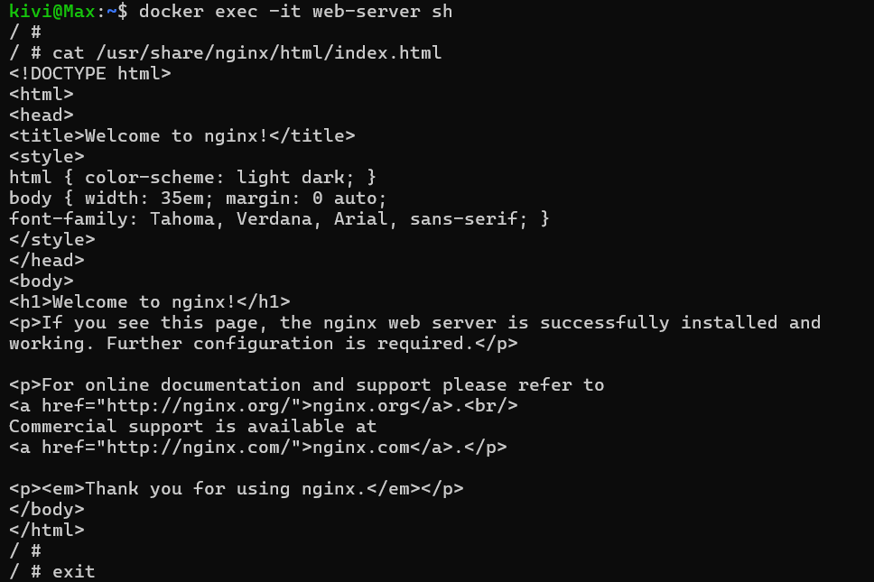

Остановка контейнера

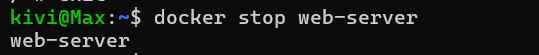

Запуск остановленного контейнера

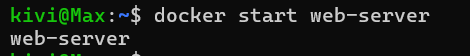

Удаление контейнера

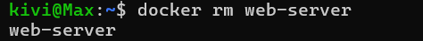

---
Практическое задание
---

Запуск контейнера PostgreSQL, установка пароля через переменную окружения

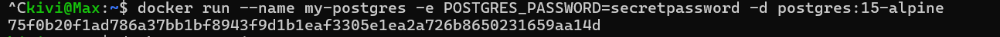

Выполнение SQL-запроса

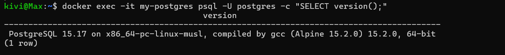

Создание именованного тома

#### 1.3 Работа с томами

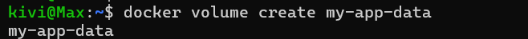

Просмотр томов

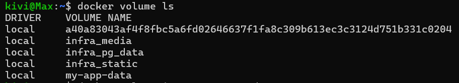

Информация о томе

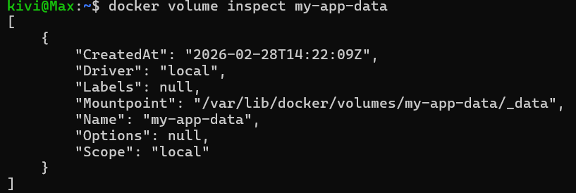

Запуск контейнера с томом

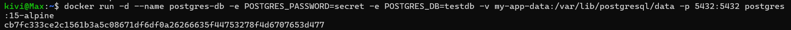

Создание тестовой таблицы

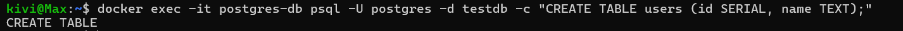
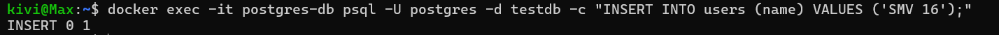

Остановка и удаление контейнера (данные сохранятся в томе)

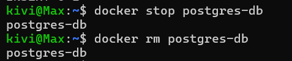

Запуск нового контейнера с тем же томом

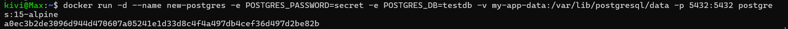

Проверка, что данные сохранились

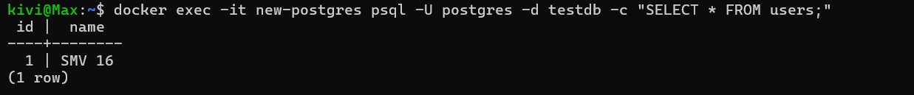

---
Практическое задание
---

Создание тома для статических файлов

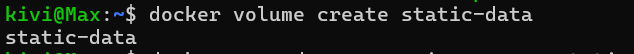

Запуск контейнера nginx:alpine с примонтированным томом и с пробрасыванием портов

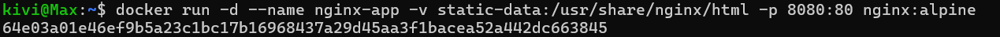

Копирование index.html в контейнер

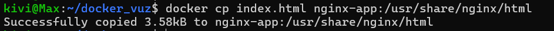

Запущенный веб-сервер на nginx

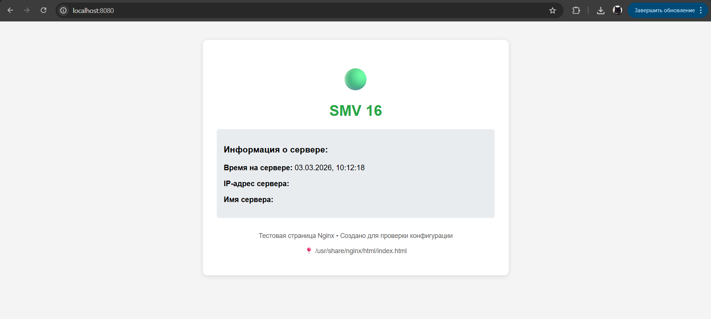

#### 1.4 Работа с сетью

Создание сети

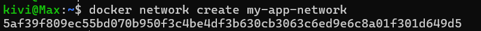

Просмотр сетей

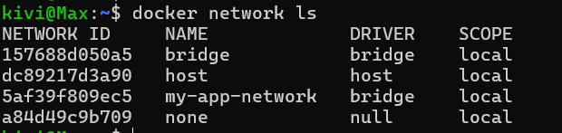

Запуск контейнеров в одной сети

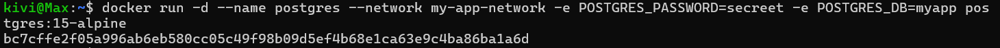

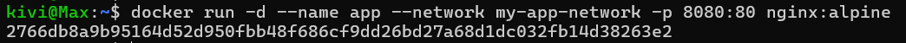

Проверка связи между контейнерами

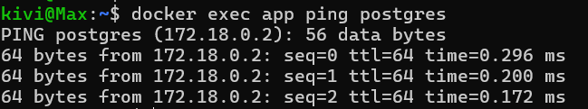

---
Практическое задание
---

Создание сети my-bridge-network

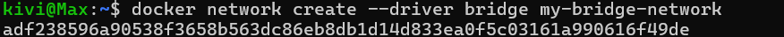

Запуск контейнеров postgres и nginx в одной сети и проверка их взаимодействия:

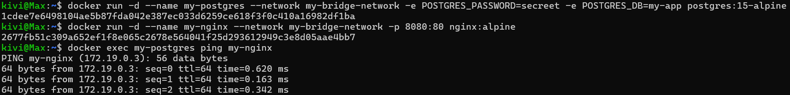

### 2. Скриншоты работающего приложения
#### 2.1 Главная страница
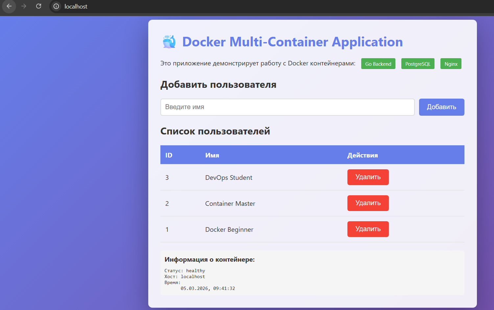
#### 2.2 Добавление пользователя
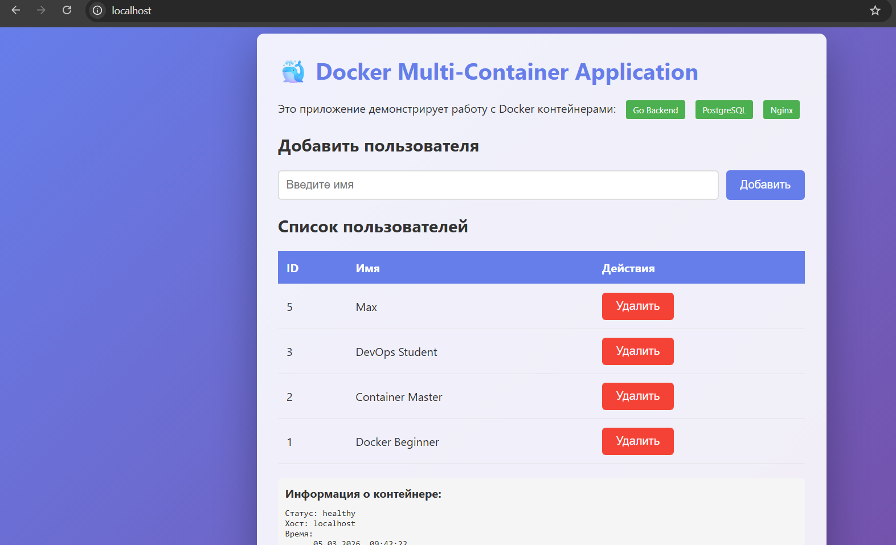
#### 2.3 Список пользователей в БД
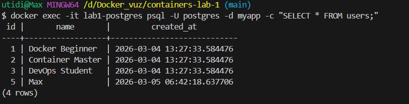
### 3. GitHub Actions
#### 3.1 Успешный запуск workflow
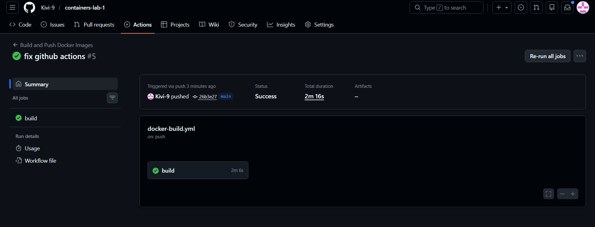
#### 3.2 Опубликованные образы в GHCR
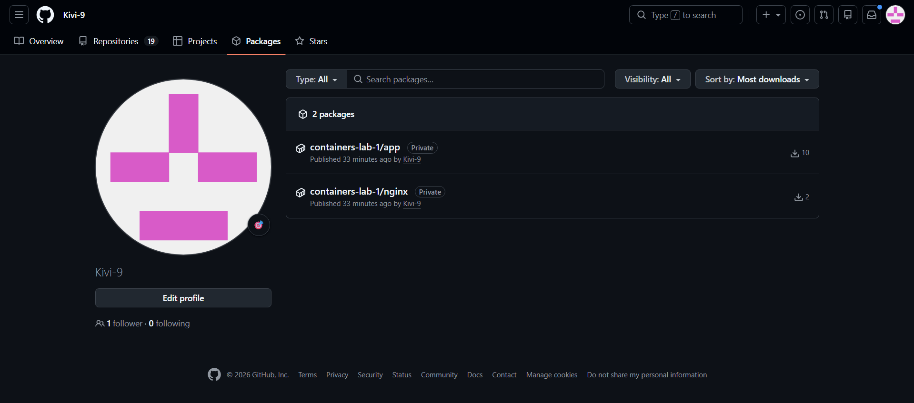
### 4. Выводы
В ходе выполнения практической работы мной были изучены и практически применены основные механизмы контейнеризации Docker. Я научился создавать собственные образы, работать с контейнерами, а также организовывать долговременное хранение данных с помощью томов. Кроме того, был освоен процесс непрерывной интеграции: для автоматизации сборки и развертывания проекта мной был настроен пайплайн с использованием GitHub Actions.